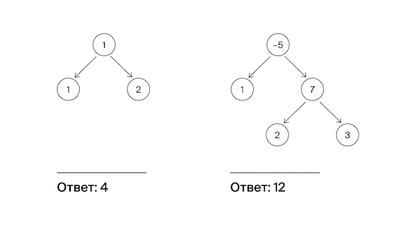

# G. Максимальный путь в дереве

Тимофей устраивает соревнования по спортивному ориентированию в своём офисе. Схема офиса представлена в виде дерева. Посещая каждый пункт, можно зарабатывать или терять очки. Если в узле записано положительное число, это значение добавляется к текущему количеству очков участника. Если отрицательное —– очки вычитаются. Если 0 –— их количество не меняется.

Нужно определить, какое максимальное число очков можно заработать, пройдя по пути из какого-то пункта A в какой-то (возможно, тот же) пункт B.

Путь не обязательно должен проходить через корень или содержать лист. Путь должен содержать по крайней мере один узел.

Пример 1:<br>
В дереве всего три вершины, во всех вершинах записаны положительные числа, поэтому объединим все три вершины в один путь. В ответе получим: 1+1+2 = 4.

Пример 2:<br>
Теперь в дереве есть вершина с отрицательным весом, через неё в данном случае проходить будет невыгодно. Оптимальный путь: 2+7+3 = 12.

Пример 3:<br>
Оптимальный путь: 7+2+3+9 = 21.

Пример 4:<br>
В этот раз имеет смысл пройти через вершину с отрицательным весом, так как в левом поддереве вершины − 3 лежит 5. Оптимальный путь: 2 +2 − 3+5 = 6.


**Требования к решению: передаваемое в качестве аргумента дерево нельзя менять. Не храните вспомогательную информацию в вершинах.**



## Формат ввода

На вход подается корень дерева.

**Замечания про отправку решений**

По умолчанию выбран компилятор make.
Решение нужно отправлять в виде файла с расширением, которое соответствует вашему языку программирования.

Go:

```go
package main

/**
Comment it before submitting 
type Node struct {  
	value  int  
	left   *Node  
	right  *Node  
}
**/

func Solution(root *Node) int {
    // Your code
    // “ヽ(´▽｀)ノ”
}
```

## Формат вывода

Функция должна вернуть число, равное максимальному количеству очков, которое можно заработать, попав из города А в город В.